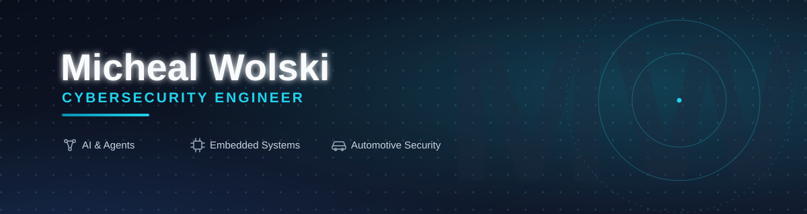

 

**B.S. Information Assurance & Cyber Defense — Eastern Michigan University, Cum Laude**  
**A.A.S. Computer Information Systems — Henry Ford College**

Former Bosch Mobility Product Cybersecurity Intern · Michigan

---

## About

I build across **cybersecurity, automotive technology, AI, automation, and software engineering**. My work ranges from security-focused applications and enterprise workflow systems to full-stack tools, embedded/vehicle technology, data platforms, and AI-assisted software.

**Interests:** Automotive Security · AI Security & Agents · Embedded Systems · Security Engineering · Full-Stack Development · Automation

---

## Selected Projects

<table>
<tr>
<td width="50%" valign="top">

### 🛡️ [AI Agent Governance](https://github.com/michealswolski/ai-agent-governance)
Self-hosted governance layer for AI agents with trace risk scoring, prompt-injection detection, risky-tool checks, human approvals, sensitive-data controls, and audit-ready records.

`Node.js` `SQLite` `AI Security` `Governance`

</td>
<td width="50%" valign="top">

### 🔎 [AutoJob Intel](https://github.com/michealswolski/auto-job-intel)
Verified job-intelligence platform with explainable matching, source-backed requirement extraction, live-status re-verification, deduplication, change history, APIs, and automated tests.

`Next.js` `React` `TypeScript` `Zod`

</td>
</tr>

<tr>
<td width="50%" valign="top">

### 🧩 [Cross-Divisional Project Database](https://github.com/michealswolski/cross-divisional-project-database)
Enterprise Power Platform application for multi-project intake, security-feature tracking, validation, autosave/resume, administrative review, notifications, support workflows, and structured Dataverse storage.

`Power Apps` `Dataverse` `Power Fx` `PowerShell`

</td>
<td width="50%" valign="top">

### 🖥️ [Wolski Command Center](https://github.com/michealswolski/wolski-command-center)
Full-stack Raspberry Pi management dashboard for system health, remote administration, SSH access, file management, hardware monitoring, and AI-assisted operations.

`React` `Node.js` `Express` `SSH` `Raspberry Pi`

</td>
</tr>

<tr>
<td width="50%" valign="top">

### 📄 [Document Analyzer AI](https://github.com/michealswolski/document-analyzer-ai)
Local-first document-analysis workflow for structured extraction, missing-information detection, risk flags, source evidence, human review, and JSON/CSV/CRM-ready exports.

`JavaScript` `AI Workflows` `Data Validation` `Local-First`

</td>
<td width="50%" valign="top">

### ⚡ Swoop — Private Project
Self-hosted AI job-application system that monitors roles, evaluates fit, tailors application materials, organizes replies, and keeps final submission decisions human-in-the-loop.

`Python` `FastAPI` `React` `TypeScript` `Claude`

**Private repository · Full case study will be available on the portfolio**

</td>
</tr>
</table>

### More Engineering Work

[**ForecastAI**](https://github.com/michealswolski/forecast-ai) — Forecast-vs-actual analytics, variance/risk scoring, driver analysis, scenario sensitivity, and grounded narrative explanations.  
[**MeshLink iOS**](https://github.com/michealswolski/meshlink-ios) — Encrypted peer-to-peer Bluetooth mesh messaging concept using Swift, BLE, NFC/QR key exchange, and AES-GCM.  
[**Network Utility Tool**](https://github.com/michealswolski/network-utility-tool) — PowerShell-based Windows networking, diagnostics, monitoring, and defensive-security toolkit.

Additional work includes **CAN / OBD-II vehicle monitoring, secure-boot research, PKI, SIEM analysis, network traffic analysis, vulnerability management, system hardening, and security automation**.

---

## Languages

## Development & Platforms

## Security, Automotive & Automation

---

### Explore the full portfolio

Projects, professional experience, case studies, and deeper technical work are available at:

## [michealswolski.github.io](https://michealswolski.github.io)

