<picture>
  <source media="(max-width: 700px) and (prefers-color-scheme: dark)" srcset="./assets/hero-compact.svg">
  <source media="(max-width: 700px)" srcset="./assets/hero-compact-light.svg">
  <source media="(prefers-color-scheme: dark)" srcset="./assets/hero.svg">
  <source media="(prefers-color-scheme: light)" srcset="./assets/hero-light.svg">
  
</picture>

 

<picture>
  <source media="(prefers-color-scheme: dark)" srcset="./assets/divider.svg">
  <source media="(prefers-color-scheme: light)" srcset="./assets/divider-light.svg">
  
</picture>

<table border="0">
<tr>
<td width="32%" align="center" valign="middle">

<picture>
  <source media="(prefers-color-scheme: dark)" srcset="./assets/credential.svg">
  <source media="(prefers-color-scheme: light)" srcset="./assets/credential-light.svg">
  
</picture>

</td>
<td width="68%" valign="middle">

### About

Cybersecurity engineer who ships. I build systems where the security controls are part of the product, not a document filed next to it — governance layers that actually block a bad agent call, detections that fire on real traffic, and firmware trust chains that hold up on a bench.

- 🛡️ **Focus:** AI agent security · automotive & embedded security · detection engineering · full-stack
- 🚗 **Previously:** Product Cybersecurity Intern at **Bosch Mobility** — automotive product security
- 🎓 **B.S. Information Assurance & Cyber Defense**, Eastern Michigan University *(Cum Laude)*
- 🎓 **A.A.S. Computer Information Systems**, Henry Ford College
- 🔬 Currently building governance and guardrails for autonomous agents — risk scoring, prompt-injection detection, human-in-the-loop approvals
- 📍 Michigan, USA · open to security engineering roles
- 📨 Reach me through [LinkedIn](https://www.linkedin.com/in/michealwolski) or my [portfolio](https://michealswolski.github.io)

</td>
</tr>
</table>

<picture>
  <source media="(prefers-color-scheme: dark)" srcset="./assets/divider.svg">
  <source media="(prefers-color-scheme: light)" srcset="./assets/divider-light.svg">
  
</picture>

## Tech Stack

Grouped by what I actually reach for, not by what looks impressive in a list.

**Languages**

**Security & Detection**

**Automotive & Embedded**

**Platform, Web & Automation**

<picture>
  <source media="(prefers-color-scheme: dark)" srcset="./assets/divider.svg">
  <source media="(prefers-color-scheme: light)" srcset="./assets/divider-light.svg">
  
</picture>

## Selected Projects

<table>
<tr>
<td width="50%" valign="top">

### 🛡️ [AI Agent Governance](https://github.com/michealswolski/ai-agent-governance)

A control plane that sits between an agent and the things it can break. Risk-scores every proposed action, screens for prompt injection, routes anything above threshold to a human, and writes an immutable audit trail.

`Node.js` · `SQLite` · `AI Security`

</td>
<td width="50%" valign="top">

### 🔎 [AutoJob Intel](https://github.com/michealswolski/auto-job-intel)

Job-intelligence platform built around verifiability: every extracted claim links back to the source posting, and matches explain themselves instead of handing you a mystery score.

`Next.js` · `React` · `TypeScript`

</td>
</tr>
<tr>
<td width="50%" valign="top">

### 🖥️ [Wolski Command Center](https://github.com/michealswolski/wolski-command-center)

Full-stack Raspberry Pi operations dashboard — live system monitoring, remote SSH access, file management, AI-assisted automation, one-click deployment.

`React` · `Node.js` · `SSH`

</td>
<td width="50%" valign="top">

### 🧩 [Cross-Divisional Project Database](https://github.com/michealswolski/Project-database)

Enterprise Power Platform application for project intake and tracking, with structured Dataverse storage and reporting across divisions.

`Power Apps` · `Dataverse` · `Power Fx`

</td>
</tr>
<tr>
<td width="50%" valign="top">

### 📄 [Document Analyzer AI](https://github.com/michealswolski/document-analyzer-ai)

Local-first document analysis — structured extraction, risk flagging, and a human review step. Nothing leaves the machine.

`JavaScript` · `AI Workflows` · `Local-First`

</td>
<td width="50%" valign="top">

### ⚡ Swoop &nbsp;·&nbsp; private

Self-hosted AI job-application agent, human-in-the-loop by design — the agent drafts and stages, a person approves and sends.

`Python` · `FastAPI` · `React` · `Claude`
 Case study on the portfolio

</td>
</tr>
</table>

More: <a href="https://github.com/michealswolski/forecast-ai">ForecastAI</a> · <a href="https://github.com/michealswolski/meshlink-ios">MeshLink iOS</a> (BLE mesh, AES-256-GCM) · <a href="https://github.com/michealswolski/network-utility-tool">Network Utility Tool</a> · <a href="https://github.com/michealswolski/michealswolski.github.io">Portfolio site</a>

<picture>
  <source media="(prefers-color-scheme: dark)" srcset="./assets/divider.svg">
  <source media="(prefers-color-scheme: light)" srcset="./assets/divider-light.svg">
  
</picture>

## Security Labs & Research

Hands-on builds behind the badges above — each one is a working lab, not a write-up.

<table>
<tr>
<td width="33%" valign="top">

**Offensive & AppSec**

- [Offensive Security Lab](https://github.com/michealswolski/offensive-security-lab) — recon → Nmap → Metasploit → privilege escalation
- [Web App Security Lab](https://github.com/michealswolski/web-app-security-lab) — Burp route discovery, input validation, misconfigured endpoints
- [Hacked Terminal Wallpaper](https://github.com/michealswolski/hacked-terminal-wallpaper) — quishing awareness demo

</td>
<td width="33%" valign="top">

**Defense & Detection**

- [Splunk SIEM Lab](https://github.com/michealswolski/splunk-siem-lab) — SPL, dashboards, spike alerting, detection tuning
- [Network Traffic Analysis](https://github.com/michealswolski/network-traffic-analysis) — Wireshark DPI, handshake and DNS anomalies
- [Python Log Automation](https://github.com/michealswolski/python-log-automation) — brute-force detection engine with rolling IP thresholds
- [System Hardening Lab](https://github.com/michealswolski/system-hardening-lab) — Windows/Linux baselines, auditd, patching

</td>
<td width="33%" valign="top">

**Vuln Mgmt, Network & Embedded**

- [Homelab Vuln Management](https://github.com/michealswolski/homelab-vuln-management) — Nessus scans, CVSS prioritization, pfSense enforcement
- [OpenVAS Scanning](https://github.com/michealswolski/openvas-scanning) — CVE analysis, risk-prioritized mitigation
- [Firewall & VPN Lab](https://github.com/michealswolski/firewall-vpn-lab) — pfSense segmentation, deny-by-default, OpenVPN
- [OBD-II Diagnostic Scanner](https://github.com/michealswolski/obd2-diagnostic-scanner) — ECU protocol comms, real-time vehicle data
- [Secure Boot Research](https://github.com/michealswolski/secure-boot-research) — TPM, chain-of-trust, MISRA C, ECU attestation
- [PKI & CA Research](https://github.com/michealswolski/pki-ca-research) — certificate authority trust models

</td>
</tr>
</table>

<picture>
  <source media="(prefers-color-scheme: dark)" srcset="./assets/divider.svg">
  <source media="(prefers-color-scheme: light)" srcset="./assets/divider-light.svg">
  
</picture>

## GitHub Activity

<picture>
  <source media="(prefers-color-scheme: dark)" srcset="https://github-readme-stats.vercel.app/api?username=michealswolski&show_icons=true&hide_border=true&bg_color=0A1526&title_color=22D3EE&icon_color=34D399&text_color=CBD5E1&ring_color=22D3EE&include_all_commits=true">
  <source media="(prefers-color-scheme: light)" srcset="https://github-readme-stats.vercel.app/api?username=michealswolski&show_icons=true&hide_border=true&bg_color=FFFFFF&title_color=0E7490&icon_color=047857&text_color=334155&ring_color=0E7490&include_all_commits=true">
  
</picture>
<picture>
  <source media="(prefers-color-scheme: dark)" srcset="https://github-readme-stats.vercel.app/api/top-langs/?username=michealswolski&layout=compact&hide_border=true&langs_count=8&bg_color=0A1526&title_color=22D3EE&text_color=CBD5E1">
  <source media="(prefers-color-scheme: light)" srcset="https://github-readme-stats.vercel.app/api/top-langs/?username=michealswolski&layout=compact&hide_border=true&langs_count=8&bg_color=FFFFFF&title_color=0E7490&text_color=334155">
  
</picture>

  

<picture>
  <source media="(prefers-color-scheme: dark)" srcset="https://streak-stats.demolab.com?user=michealswolski&hide_border=true&background=0A1526&ring=22D3EE&fire=34D399&currStreakLabel=22D3EE&sideLabels=CBD5E1&currStreakNum=F8FAFC&sideNums=F8FAFC&dates=64748B">
  <source media="(prefers-color-scheme: light)" srcset="https://streak-stats.demolab.com?user=michealswolski&hide_border=true&background=FFFFFF&ring=0E7490&fire=047857&currStreakLabel=0E7490&sideLabels=334155&currStreakNum=0F172A&sideNums=0F172A&dates=64748B">
  
</picture>

  

<picture>
  <source media="(prefers-color-scheme: dark)" srcset="https://github-readme-activity-graph.vercel.app/graph?username=michealswolski&hide_border=true&bg_color=0A1526&color=22D3EE&line=34D399&point=F8FAFC&area=true&area_color=22D3EE&custom_title=Contribution%20Activity">
  <source media="(prefers-color-scheme: light)" srcset="https://github-readme-activity-graph.vercel.app/graph?username=michealswolski&hide_border=true&bg_color=FFFFFF&color=0E7490&line=047857&point=0F172A&area=true&area_color=0E7490&custom_title=Contribution%20Activity">
  
</picture>

  

<picture>
  <source media="(prefers-color-scheme: dark)" srcset="https://github-profile-trophy.vercel.app/?username=michealswolski&no-frame=true&no-bg=true&column=7&margin-w=8&margin-h=8&title_color=22D3EE&text_color=CBD5E1">
  <source media="(prefers-color-scheme: light)" srcset="https://github-profile-trophy.vercel.app/?username=michealswolski&no-frame=true&no-bg=true&column=7&margin-w=8&margin-h=8&title_color=0E7490&text_color=334155">
  
</picture>

### 🐍 The snake that eats my contributions

<picture>
  <source media="(prefers-color-scheme: dark)" srcset="https://raw.githubusercontent.com/michealswolski/michealswolski/output/snake-dark.svg">
  <source media="(prefers-color-scheme: light)" srcset="https://raw.githubusercontent.com/michealswolski/michealswolski/output/snake-light.svg">
  
</picture>

<picture>
  <source media="(prefers-color-scheme: dark)" srcset="./assets/divider.svg">
  <source media="(prefers-color-scheme: light)" srcset="./assets/divider-light.svg">
  
</picture>

## Let's Connect

  

  

<i>Trust · Verify · Ship — security that survives contact with production.</i>

