<picture>
  <source media="(max-width: 700px) and (prefers-color-scheme: dark)" srcset="./assets/hero-compact.svg">
  <source media="(max-width: 700px)" srcset="./assets/hero-compact-light.svg">
  <source media="(prefers-color-scheme: dark)" srcset="./assets/hero.svg">
  <source media="(prefers-color-scheme: light)" srcset="./assets/hero-light.svg">
  
</picture>

 

<a href="https://michealswolski.github.io"><picture><source media="(prefers-color-scheme: dark)" srcset="./assets/connect-portfolio.svg"><source media="(prefers-color-scheme: light)" srcset="./assets/connect-portfolio-light.svg"></picture></a>
<a href="https://www.linkedin.com/in/michealwolski"><picture><source media="(prefers-color-scheme: dark)" srcset="./assets/connect-linkedin.svg"><source media="(prefers-color-scheme: light)" srcset="./assets/connect-linkedin-light.svg"></picture></a>
<a href="https://github.com/michealswolski"><picture><source media="(prefers-color-scheme: dark)" srcset="./assets/connect-github.svg"><source media="(prefers-color-scheme: light)" srcset="./assets/connect-github-light.svg"></picture></a>

<picture>
  <source media="(prefers-color-scheme: dark)" srcset="./assets/divider.svg">
  <source media="(prefers-color-scheme: light)" srcset="./assets/divider-light.svg">
  
</picture>

<table border="0">
<tr>
<td width="32%" align="center" valign="middle">

<picture>
  <source media="(prefers-color-scheme: dark)" srcset="./assets/credential.svg">
  <source media="(prefers-color-scheme: light)" srcset="./assets/credential-light.svg">
  
</picture>

</td>
<td width="68%" valign="middle">

<h3><picture><source media="(prefers-color-scheme: dark)" srcset="./assets/head-about.svg"><source media="(prefers-color-scheme: light)" srcset="./assets/head-about-light.svg"></picture></h3>

Cybersecurity engineer who ships, across automotive and software alike. I build systems where the security controls are part of the product, not a document filed next to it — firmware trust chains that hold up on a bench, detections that fire on real traffic, and governance layers that actually block a bad agent call.

-  **Focus:** automotive & embedded security · AI agent security · detection engineering · full-stack
-  **Previously:** Product Cybersecurity Intern at **Bosch Mobility** — automotive product security
-  **B.S. Information Assurance & Cyber Defense**, Eastern Michigan University *(Cum Laude)*
-  **A.A.S. Computer Information Systems**, Henry Ford College
-  Currently building governance and guardrails for autonomous agents — risk scoring, prompt-injection detection, human-in-the-loop approvals
-  Michigan, USA · open to security engineering roles
-  Reach me through [LinkedIn](https://www.linkedin.com/in/michealwolski) or my [portfolio](https://michealswolski.github.io)

</td>
</tr>
</table>

<picture>
  <source media="(prefers-color-scheme: dark)" srcset="./assets/divider.svg">
  <source media="(prefers-color-scheme: light)" srcset="./assets/divider-light.svg">
  
</picture>

<h2><picture><source media="(prefers-color-scheme: dark)" srcset="./assets/head-experience.svg"><source media="(prefers-color-scheme: light)" srcset="./assets/head-experience-light.svg"></picture></h2>

**Product Cybersecurity Intern · Bosch Mobility** &nbsp;·&nbsp; Product Security / M-TEL · Farmington Hills, MI · 2025–2026

| | |
|---|---|
| **Product security visibility** | Built an intake and reporting platform used across multiple engineering divisions, replacing spreadsheet tracking with a shared system of record — intake wizard, status model, validation, admin review queue. |
| **Process automation** | Automated a manual engineering workflow end to end with Power Automate and SharePoint, cutting out repeated cross-team coordination. |
| **Secure boot research** | Researched secure boot for automotive ECUs — chain-of-trust verification and TPM-based attestation, and how they map to real vehicle architectures. Turned it into an internal one-pager through documentation review and SME interviews. |
| **AI & knowledge tooling** | Built an LLM onboarding assistant prototype at an internal AI hackathon, and an AI-assisted whitepaper drafting tool for technical documentation. |
| **Exercises** | Supported an automotive cybersecurity fire drill and a cross-divisional awareness event; took part in an internal CTF and AI hackathon. |

Public-facing summary. No confidential company information, internal data, source code, or proprietary material is disclosed.

<picture>
  <source media="(prefers-color-scheme: dark)" srcset="./assets/divider.svg">
  <source media="(prefers-color-scheme: light)" srcset="./assets/divider-light.svg">
  
</picture>

<h2><picture><source media="(prefers-color-scheme: dark)" srcset="./assets/head-projects.svg"><source media="(prefers-color-scheme: light)" srcset="./assets/head-projects-light.svg"></picture></h2>

<table>
<tr>
<td width="50%" valign="top">

###  [AI Agent Governance](https://github.com/michealswolski/ai-agent-governance)

A control plane that sits between an agent and the things it can break. Risk-scores every proposed action, screens for prompt injection, routes anything above threshold to a human, and writes a durable, audit-ready decision history.

`Node.js` · `SQLite` · `AI Security`

</td>
<td width="50%" valign="top">

###  [AutoJob Intel](https://github.com/michealswolski/auto-job-intel)

Job-intelligence platform built around verifiability: every extracted claim links back to the source posting, and matches explain themselves instead of handing you a mystery score.

`Next.js` · `React` · `TypeScript`

</td>
</tr>
<tr>
<td width="50%" valign="top">

###  [Wolski Command Center](https://github.com/michealswolski/wolski-command-center)

Full-stack Raspberry Pi operations dashboard — live system monitoring, remote SSH access, file management, AI-assisted automation, one-click deployment.

`React` · `Node.js` · `SSH`

</td>
<td width="50%" valign="top">

###  [Cross-Divisional Project Database](https://github.com/michealswolski/Project-database)

Enterprise Power Platform application for project intake and tracking, backed by SharePoint Online lists with Power BI reporting across divisions.

`Power Apps` · `SharePoint` · `Power Fx`

</td>
</tr>
<tr>
<td width="50%" valign="top">

###  [Document Analyzer AI](https://github.com/michealswolski/document-analyzer-ai)

Local-first document analysis — structured extraction, risk flagging, and a human review step. Nothing leaves the machine.

`JavaScript` · `AI Workflows` · `Local-First`

</td>
<td width="50%" valign="top">

###  Swoop &nbsp;·&nbsp; private

Self-hosted AI job-application agent, human-in-the-loop by design — the agent drafts and stages, a person approves and sends.

`Python` · `FastAPI` · `React` · `Claude`
 Case study on the portfolio

</td>
</tr>
</table>

More: <a href="https://github.com/michealswolski/forecast-ai">ForecastAI</a> · <a href="https://github.com/michealswolski/meshlink-ios">MeshLink iOS</a> (BLE mesh, AES-256-GCM) · <a href="https://github.com/michealswolski/network-utility-tool">Network Utility Tool</a> · <a href="https://github.com/michealswolski/michealswolski.github.io">Portfolio site</a>

<picture>
  <source media="(prefers-color-scheme: dark)" srcset="./assets/divider.svg">
  <source media="(prefers-color-scheme: light)" srcset="./assets/divider-light.svg">
  
</picture>

<h2><picture><source media="(prefers-color-scheme: dark)" srcset="./assets/head-labs.svg"><source media="(prefers-color-scheme: light)" srcset="./assets/head-labs-light.svg"></picture></h2>

Hands-on builds — each one is a working lab, not a write-up.

<table>
<tr>
<td width="33%" valign="top">

**Offensive & AppSec**

- [Offensive Security Lab](https://github.com/michealswolski/offensive-security-lab) — recon → Nmap → Metasploit → privilege escalation
- [Web App Security Lab](https://github.com/michealswolski/web-app-security-lab) — Burp route discovery, input validation, misconfigured endpoints
- [Hacked Terminal Wallpaper](https://github.com/michealswolski/hacked-terminal-wallpaper) — quishing awareness demo

</td>
<td width="33%" valign="top">

**Defense & Detection**

- [Splunk SIEM Lab](https://github.com/michealswolski/splunk-siem-lab) — SPL, dashboards, spike alerting, detection tuning
- [Network Traffic Analysis](https://github.com/michealswolski/network-traffic-analysis) — Wireshark DPI, handshake and DNS anomalies
- [Python Log Automation](https://github.com/michealswolski/python-log-automation) — brute-force detection engine with rolling IP thresholds
- [System Hardening Lab](https://github.com/michealswolski/system-hardening-lab) — Windows/Linux baselines, auditd, patching

</td>
<td width="33%" valign="top">

**Vuln Mgmt, Network & Embedded**

- [Homelab Vuln Management](https://github.com/michealswolski/homelab-vuln-management) — Nessus scans, CVSS prioritization, pfSense enforcement
- [OpenVAS Scanning](https://github.com/michealswolski/openvas-scanning) — CVE analysis, risk-prioritized mitigation
- [Firewall & VPN Lab](https://github.com/michealswolski/firewall-vpn-lab) — pfSense segmentation, deny-by-default, OpenVPN
- [OBD-II Diagnostic Scanner](https://github.com/michealswolski/obd2-diagnostic-scanner) — ECU protocol comms, real-time vehicle data
- [Secure Boot Research](https://github.com/michealswolski/secure-boot-research) — TPM, chain-of-trust, MISRA C, ECU attestation
- [PKI & CA Research](https://github.com/michealswolski/pki-ca-research) — certificate authority trust models

</td>
</tr>
</table>

<picture>
  <source media="(prefers-color-scheme: dark)" srcset="./assets/divider.svg">
  <source media="(prefers-color-scheme: light)" srcset="./assets/divider-light.svg">
  
</picture>

<h2><picture><source media="(prefers-color-scheme: dark)" srcset="./assets/head-activity.svg"><source media="(prefers-color-scheme: light)" srcset="./assets/head-activity-light.svg"></picture></h2>

<picture>
  <source media="(prefers-color-scheme: dark)" srcset="https://raw.githubusercontent.com/michealswolski/michealswolski/output/stats.svg">
  <source media="(prefers-color-scheme: light)" srcset="https://raw.githubusercontent.com/michealswolski/michealswolski/output/stats-light.svg">
  
</picture>
<picture>
  <source media="(prefers-color-scheme: dark)" srcset="https://raw.githubusercontent.com/michealswolski/michealswolski/output/languages.svg">
  <source media="(prefers-color-scheme: light)" srcset="https://raw.githubusercontent.com/michealswolski/michealswolski/output/languages-light.svg">
  
</picture>

 

<picture>
  <source media="(prefers-color-scheme: dark)" srcset="https://raw.githubusercontent.com/michealswolski/michealswolski/output/focus.svg">
  <source media="(prefers-color-scheme: light)" srcset="https://raw.githubusercontent.com/michealswolski/michealswolski/output/focus-light.svg">
  
</picture>

 

###  The snake that eats my contributions

<picture>
  <source media="(prefers-color-scheme: dark)" srcset="https://raw.githubusercontent.com/michealswolski/michealswolski/output/snake-dark.svg">
  <source media="(prefers-color-scheme: light)" srcset="https://raw.githubusercontent.com/michealswolski/michealswolski/output/snake-light.svg">
  
</picture>

<picture>
  <source media="(prefers-color-scheme: dark)" srcset="./assets/divider.svg">
  <source media="(prefers-color-scheme: light)" srcset="./assets/divider-light.svg">
  
</picture>

<picture>
  <source media="(prefers-color-scheme: dark)" srcset="./assets/domains.svg">
  <source media="(prefers-color-scheme: light)" srcset="./assets/domains-light.svg">
  
</picture>

  

<h2><picture><source media="(prefers-color-scheme: dark)" srcset="./assets/head-connect.svg"><source media="(prefers-color-scheme: light)" srcset="./assets/head-connect-light.svg"></picture></h2>

<a href="https://michealswolski.github.io"><picture><source media="(prefers-color-scheme: dark)" srcset="./assets/connect-portfolio.svg"><source media="(prefers-color-scheme: light)" srcset="./assets/connect-portfolio-light.svg"></picture></a>
<a href="https://www.linkedin.com/in/michealwolski"><picture><source media="(prefers-color-scheme: dark)" srcset="./assets/connect-linkedin.svg"><source media="(prefers-color-scheme: light)" srcset="./assets/connect-linkedin-light.svg"></picture></a>
<a href="https://github.com/michealswolski"><picture><source media="(prefers-color-scheme: dark)" srcset="./assets/connect-github.svg"><source media="(prefers-color-scheme: light)" srcset="./assets/connect-github-light.svg"></picture></a>

  

<i>Trust · Verify · Ship — security that survives contact with production.</i>

